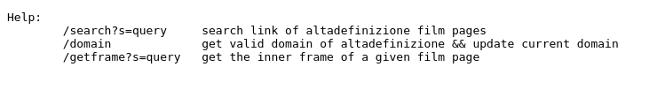

# scraping-no-stop altadefinizione

### Init

commands to get the project running
```sh
git clone #link.git thi repo
cd pup
npm i 
npm run start
```


### Get Started
the program provide 2 service scraped from *https://altadefinizione.sale/*

- search the name of the film passed as params (links.ts)
```ts
// Example (index.ts):
import link from "./links";

links("matrix")

// logs:
// [ 'https://altadefinizione.sale/matrix-streaming-4k/',
//   'https://altadefinizione.sale/matrix-reloaded-streaming-4k/',
//   'https://altadefinizione.sale/matrix-revolutions-streaming-4k/',
//   'https://altadefinizione.sale/il-linguaggio-della-matrix-divina-streaming/',
//   'https://altadefinizione.sale/animatrix-streaming-4k/' ]
```


- return the iframe.src link for a given "filmpage". 

```ts
// Example (index.ts):
import mp4 from "./mp4";

mp4('https://altadefinizione.sale/matrix-streaming-4k/')

// logs:
// https://streamtape.com/e/08PvG0LD3aCbr3e
```


# REST api
in the folder src/Server is palced the route of the api it provide scraping service over the network
<br>
<bl>
<p>home page with instruction of service</p>

